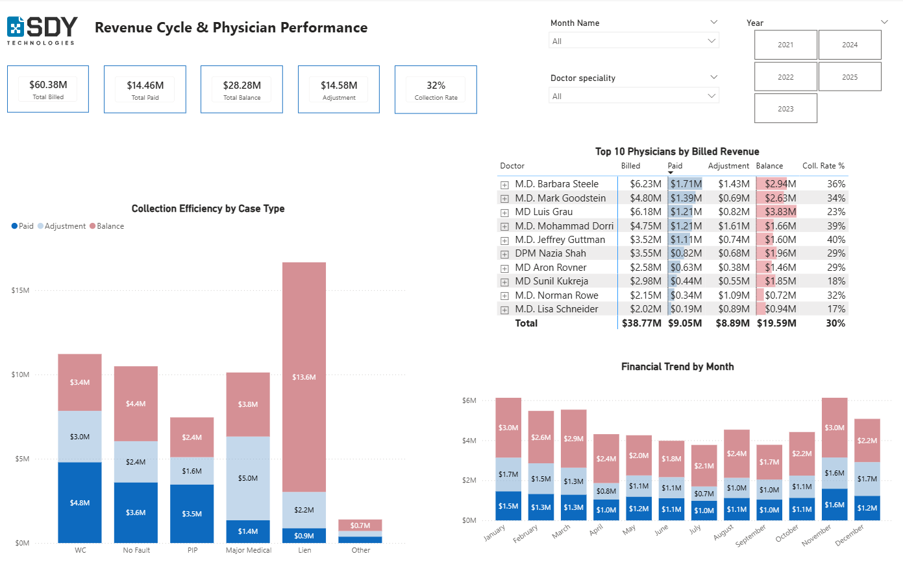

# medical-billing-analytics-performance
Interactive Power BI dashboard for analyzing financial &amp; operational efficiency in a medical network.

# Medical Billing & Operational Efficiency Dashboard (2021–2025)

## 🎯 Project Objective
The goal of this project was to analyze the financial and operational health of a multi-specialty medical network. I focused on evaluating the **"Efficiency Gap"** across various insurance types (Lien vs. Workers' Comp) and benchmarking provider performance based on actual collection rates.

## 📊 Dashboard Overview (Screenshots)

*Note: Due to data confidentiality, the full .pbix file is available upon request. Below are the key pages representing the solution.*

### 1. Home Page & Strategic Insights
This page provides an executive overview of the network's financial portfolio and identifies key revenue risks.


**Key Insight:** Identified that the Lien segment, despite high billing volume, has a critically low **6% Collection Rate**, representing a major revenue leak.

### 2. Operational Flow & "Wednesday Peak" Analysis
This page analyzes capacity and patient visit dynamics to optimize clinic workflow.



**Key Insight:** Discovered a recurring operational bottleneck on **Wednesday mornings (7 AM - 12 PM)**, causing administrative strain and faster visit times.

---

## 🛠️ Tech Stack & Technical Implementation

* **Tools:** Power BI Desktop, DAX, SQL.
* **Key Technique:** Implemented a **Bridge Table architecture** to eliminate "Double Counting" across 30+ locations, ensuring a **"Single Version of Truth."**

### 🛠️ Key DAX Implementation Highlights

To ensure data integrity and solve complex business logic, I implemented several advanced DAX measures:

#### 1. Advanced Data Modeling (Bridge Table & Inactive Relationships)
This measure is the core of the "Single Version of Truth" architecture. 

```dax
Billed by Practice = 
CALCULATE(
    [Total_Billed],
    USERELATIONSHIP(Bridge_Cases_Practice[cases_id], Dim_Cases[case_id])
)
```
#### 2. Business Logic Efficiency
Using the `DIVIDE` function to safely handle calculations and measure real-world collection performance.

```dax
Net_Collection_Rate = 
DIVIDE(
    [Total_Paid], 
    ([Total_Billed] - [Total Adjustment]), 
    0
)
---
```
## 📖 Methodology & Glossary

### 💰 Financial KPIs
* **Billed Amount**: Total gross revenue invoiced to insurance partners.
* **Paid Amount**: Actual cash collected (Net Revenue).
* **Adjustment**: Contractual write-offs. High adjustments often indicate billing errors or poor insurance contracts.
* **Collection Rate**: Efficiency metric calculated as `Paid / (Billed - Adjustment)`. It shows how much of the "collectible" money actually reached the bank.
* **Financial Risk Zone**: Any balance aged over 90 days is categorized as a high-risk recovery zone.

### 🏥 Insurance Categories
* **WC (Workers' Comp)**: Coverage for work-related injuries. Our most stable segment with the highest collection efficiency (59%).
* **No-Fault (NF)**: Claims from auto accidents, paid regardless of liability (40% collection rate).
* **PIP (Personal Injury Protection)**: Medical expense coverage for vehicle-related accidents.
* **Major Medical**: Standard health insurance. Requires monitoring due to high contractual adjustments.
* **Lien**: Legal-based cases. Highest billing volume but poorest financial return (6% collection rate) due to long-term legal settlements.

### ⚙️ Data Integrity & Methodology
* **Bridge Table Architecture**: A structural model that eliminates "Double Counting," ensuring a **Single Version of Truth** across 30+ locations.
* **Efficiency Benchmark**: Comparing providers (like Dr. Steele or Dr. Dorri) against their **Specialty Average**, rather than a flat list.
* **USERELATIONSHIP**: A DAX technique used to precisely map every dollar to the correct provider-practice intersection.
